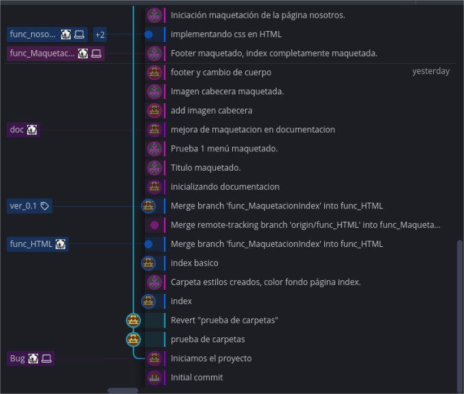

## Bienvenido a la documentacion 

Esta es la pagina de documentacion del ejercicio realizado por Belen Navarro e Israel Molina de la clase
2º DAW para la asignatura de implementacion impartida por Jose Luis Gonzalez . Dicho proyecto engloba los conocimientos
adquiridos hasta la fecha 29/09/2020  en todos los modulos.

### Reparto de trabajo

En este trabajo iniciamos la reparticion separando en dos partes el trabajo HTML y CSS, 
Israel llevaba a cabo el HTML y Belen Maquetaba con el CSS.Creando una rama de la rama padre func_X creamos una HTML y otra CSS.

Llegada la parte de javascrip fue un trabajo conjunto , primero trabajamos uno y realizabamos commit & push para que el otro fuese visualizando el codigo.
Llegado al punto donde el otro compañero localizaba algun fallo realizaba cambios en el mismo documento y avisando via mensajeria de su correcion y resolviamos los conflictos al unir cambios.

Por ultimo belen se encargo de todo HTML y CSS de mensaje  y yo creaba las funciones para sacar informacion de Local Strorage.

## Comandos y trabajo con GIT 
Principalmente la organizacion de este trabajo se ha basado en ramas de trabajo independiente con ficheros distintos para cada miembro del equipo.
teniendo claro que a la hora de realizar los merge nos posicionabamos en la rama padre de trabajo.

Llegado el punto de trabajo en un mismo fichero lo realizabamos uno trabajando en el JavaScript mientras el otro auditaba los cambios localizando fallos.

En resumen la parte mas utilizada de GIT ha sido con los comandos en este orden
    
    - Git checkout dev
    - git branch func_X
    - git checkout func_X
    - git branch X_trabajo1
    - git branch X_trabajo2
    
al finalizar las tareas y tener nuestros commit y push.

    - git checkout func_X
    - git merge X_trabajo1
    - git merge X_trabajo2
    - git checkout dev
    - git merge func_X

